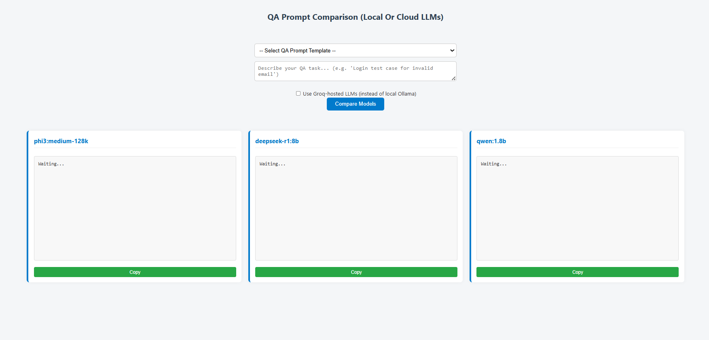

# QA Prompt Comparison (Local Or Cloud LLMs)


Compare outputs from 3 locally hosted LLMs (via [Ollama](https://ollama.com)) **or** 3 cloud-hosted LLMs (via [Groq API](https://console.groq.com/)).
This tool helps QA professionals validate AI outputs for test automation, bug triage, and more.

---


## 🚀 Features

- Compare 3 LLMs at once (local or cloud)
- Toggle between local (Ollama) and cloud (Groq API) models in the UI
- Fully offline with Ollama, or use Groq for cloud LLMs
- Fast, lightweight, and private
- Simple, responsive UI with QA-focused tools

---


## 🧱 Requirements

**For Local LLMs:**
- [Ollama](https://ollama.com/) (for running models locally)

**For Cloud LLMs:**
- [Groq API Key](https://console.groq.com/) (free tier available)
- Node.js (for the API proxy server)

**For Both:**
- [VS Code](https://code.visualstudio.com/) + Live Server extension

---

## 🎯 QA-Specific Tasks Supported

- Generate test cases from requirements
- Convert scenarios to Gherkin
- Summarize test failures or logs
- Generate assertion code from plain language
- Compare coverage across models
- Explain automation errors (stack traces, type errors)

---


## 📦 Setup Instructions

### 1. Clone the Repo
```bash
git clone https://github.com/your-username/llm-qa-assistant.git
cd llm-qa-assistant
```

<div style="display: flex; gap: 32px; flex-wrap: wrap; align-items: flex-start;">

<div style="flex:1; min-width:320px;">
<b>▶️ Local LLMs (Ollama)</b>

```bash
ollama pull phi3:medium-128k
ollama pull deepseek-r1:8b
ollama pull qwen:1.8b
ollama serve
```

Open `index.html` with Live Server in VS Code.  
Type a QA prompt and click "Compare Models".
</div>

<div style="flex:1; min-width:320px;">
<b>☁️ Cloud LLMs (Groq API)</b>

1. Create a `.env` file in the project root:
   ```env
   GROQ_API_KEY=your-groq-api-key-here
   ```
2. Install dependencies:
   ```bash
   npm install
   ```
3. Start the Groq API proxy server:
   ```bash
   npm start
   ```
4. Open `index.html` with Live Server in VS Code.
5. Check the "Use Groq-hosted LLMs" box in the UI before comparing.
</div>

</div>

---

---


## 🖼️ Screenshots

<div style="display: flex; gap: 32px; flex-wrap: wrap; align-items: flex-start;">
<div style="flex:1; min-width:320px;">
<b>Local LLMs (Ollama)</b><br>

</div>
<div style="flex:1; min-width:320px;">
<b>Cloud LLMs (Groq API)</b><br>

</div>
</div>

---
